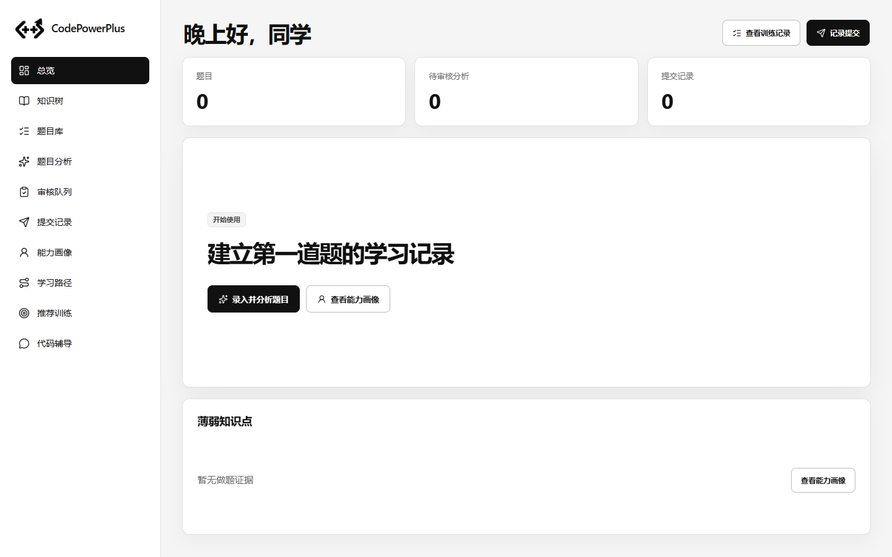
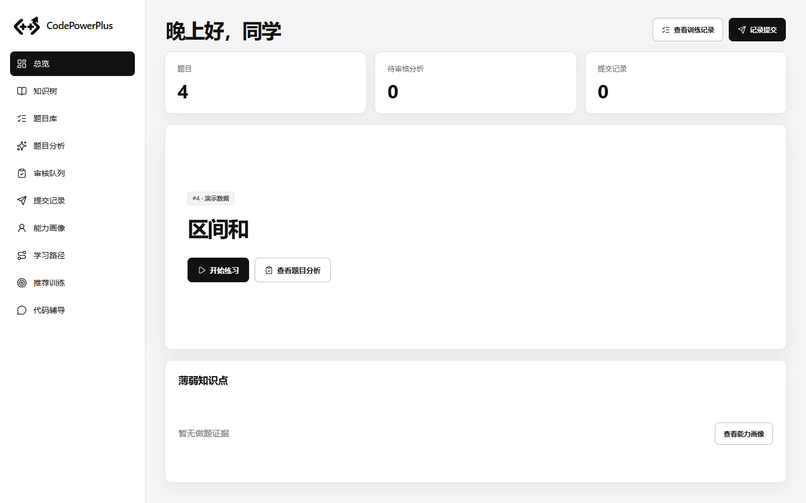
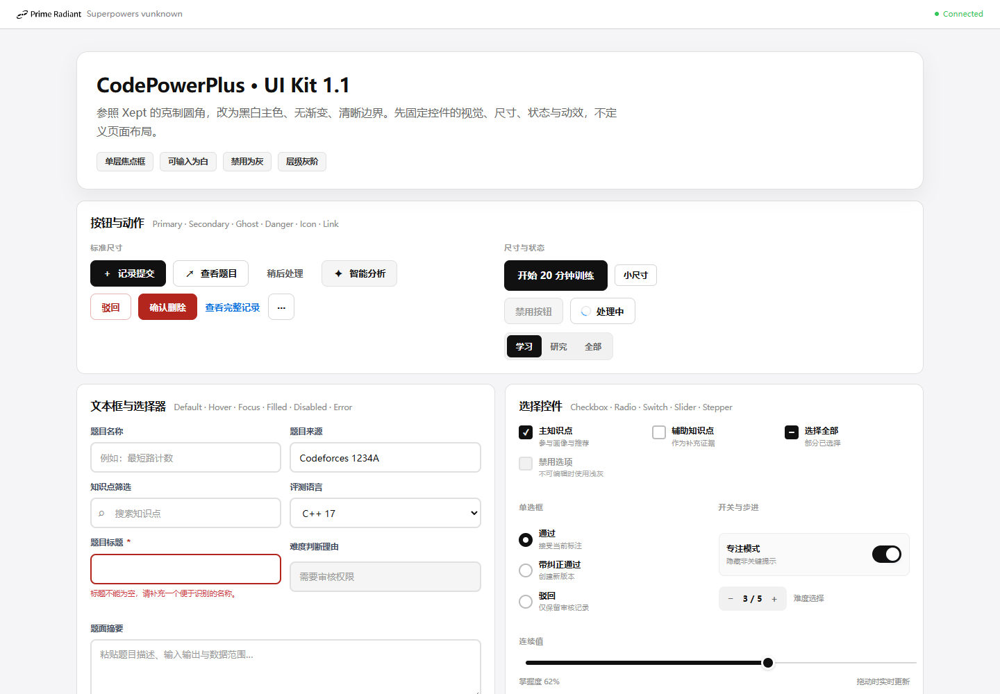
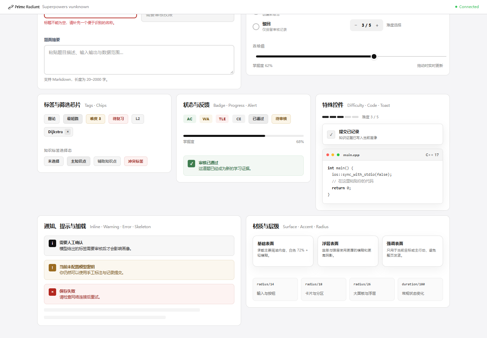
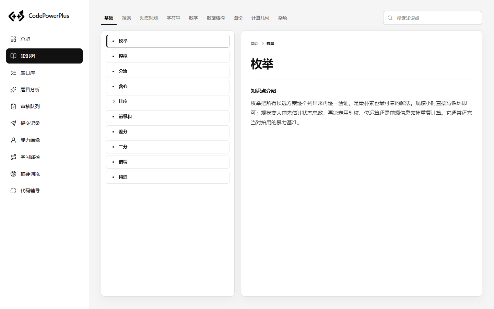

# CodePowerPlus 前端最终参考模板

最后更新：2026-09-14  
状态：**总览与知识树最终版已确认；全局外壳与组件规范已确认。其他业务页面尚未逐个完成最终布局。**

> 这是后续所有前端 UI 对话的权威参考文件。若本文件与 `README.md`、`handoff.md`、历史进度记录或旧截图冲突，以本文件为准。  
> 后续任何页面都必须先继承这里的外壳、颜色、字号、圆角、边界、按钮、输入、卡片和动效规则，再设计页面自身布局。

## 0. 后续对话使用协议

1. 开始前端 UI 任务前，先完整阅读本文件、`tokens.json`、`foundations.md`、`components.md` 和 `motion.md`。
2. 最新用户说明优先于本文件；如果用户确认了新要求，必须同步更新本文件，避免下一次对话使用旧规则。
3. 当前阶段优先实现样式和视觉结构，不新增业务逻辑，除非用户明确要求。
4. 不要恢复已明确删除的旧元素，包括顶部栏、侧栏分组标题、侧栏底部状态、黑色 Hero、主卡右侧灰色小卡和 Logo。
5. 不要重新定义第二套颜色、圆角、边框、阴影或动效 token。
6. 其他页面可以复用总览外壳和组件规范，但不能把总览的业务结构机械复制到所有页面。

## 1. 产品与视觉方向

- 形态：浏览器内全屏桌面工作台，不是原生桌面窗口。
- 气质：明亮、通透、克制，接近 macOS 与 visionOS 的秩序感。
- 参考：借鉴 `https://xept.online/projects` 的控件尺度、留白、边界和信息密度，不复制其品牌或业务。
- 主色：白色、黑色、标准灰。彩色只用于语义状态。
- 风格：简洁、大气、平滑，有足够明显的悬停和进入动效，但不做无意义漂浮。
- 禁止：渐变、紫色品牌色、蓝紫光晕、玻璃高光、厚重黑块、胶囊化卡片。

## 2. 全局工作台外壳

### 2.1 布局

- 左侧栏固定宽度：`260px`。
- 左侧栏固定，不随主体滚动。
- 不设置顶部栏。
- 页面标题直接进入主体首行，不显示 `DASHBOARD` 等英文眉题。
- 只有主体 `main` 独立滚动；侧栏不滚出视口。
- 主体内边距：`30px 34px 36px`。
- 标准桌面 `1440×900`：总览必须完整放下，不出现主体滚动条。
- `1280×800`：总览同样必须完整放下。
- `1024px` 及更窄：允许主体纵向滚动，但不得出现横向溢出。

### 2.2 品牌区

- 左上角使用透明 Logo：`/static/assets/codepowerplus-mark.png`。
- Logo 尺寸：约 `48×36px`，`object-fit: contain`。
- Logo 右侧只显示英文：`CodePowerPlus`。
- 不显示中文品牌名，不显示“智能编程辅导系统”。
- 艺术字体尚未最终确定；只修改 CSS 变量 `--wordmark-font`，不要擅自换文案。
- 当前占位字体栈：`Avenir Next`, `SF Pro Rounded`, `Segoe UI`, sans-serif。

### 2.3 左侧导航

- 只保留关键功能入口，不显示“工作台”“训练与研究”等分组标题。
- 不显示“当前学习者”“知识体系版本”“模型已配置”等底部信息。
- 导航字号：`14px`。
- 导航字重：`400`。
- 行高：`44px`。
- 图标：`18px`，线性图标，与文字左对齐。
- 普通文字颜色：`#111111`。
- 激活项：黑底白字，圆角 `8px`。
- Hover：浅灰背景 `#F1F1F1`，不位移超过 `1px`。
- 导航不做胶囊追逐动画，不播放整页滑动动画。

## 3. 色彩 Token

| Token | 值 | 用途 |
| --- | --- | --- |
| Canvas | `#F5F5F5` | 页面底色 |
| Surface | `#FFFFFF` | 卡片、输入框、弹层 |
| Surface 2 | `#FAFAFA` | 次级区块 |
| Surface Muted | `#F1F1F1` | 导航 hover、禁用背景、辅助区 |
| Ink | `#111111` | 主文字、主按钮、选中态 |
| Ink Soft | `#666666` | 次级文字 |
| Ink Faint | `#999999` | 占位符、弱提示 |
| Line | `#E0E0E0` | 默认边界 |
| Line Strong | `#BDBDBD` | Hover 边界、次级按钮边界 |
| Brand Hover | `#000000` | 黑底按钮 Hover |
| Success | `#3F7D4F` / `#EDF7F0` | AC、成功 |
| Warning | `#9B6B1F` / `#FBF5E9` | 待审核、警告 |
| Danger | `#B3261E` / `#FDF1F0` | 错误、驳回、TLE |

规则：

- 普通卡片默认白色。
- 黑色只用于文字、主按钮、选中态、边界和小面积强调，不用于大面积卡片背景。
- 功能色只表达状态，不参与普通装饰。

## 4. 字体、圆角、阴影

### 4.1 字体栈

```css
--font: -apple-system, BlinkMacSystemFont, "Segoe UI", Roboto, Oxygen, Ubuntu, Cantarell, "PingFang SC", "Microsoft YaHei", sans-serif;
--mono: ui-monospace, SFMono-Regular, Menlo, Consolas, "Liberation Mono", monospace;
```

### 4.2 圆角

| 元素 | 圆角 |
| --- | --- |
| 输入框、按钮 | `8px` |
| 小按钮、标签、树节点 | `6px` |
| 普通卡片 | `12px` |
| 大面板、Modal | `16px` |
| 状态标签 | `9px` |
| 知识树等级标记 | `5px` |

不要把普通卡片做成胶囊或超大圆角。

### 4.3 阴影

- 普通卡片：`0 10px 28px rgba(0,0,0,.045)` 或更轻。
- 总览主卡：`0 16px 42px rgba(0,0,0,.055)`。
- Hover 抬升：最多 `translateY(-2px)`，阴影不超过 `0 20px 48px rgba(0,0,0,.07)`。
- 禁止彩色阴影、蓝紫光晕和厚重玻璃光圈。

## 5. 通用组件最终规范

### 5.1 按钮

| 类型 | 背景 | 文字 | 边框 | 用途 |
| --- | --- | --- | --- | --- |
| Primary | `#111111` | `#FFFFFF` | `1px #111111` | 当前区域主动作 |
| Secondary | `#FFFFFF` | `#111111` | `1px #BDBDBD` | 次要动作 |
| Ghost | 透明 | `#555555` | 透明 | 低优先级动作 |
| Danger | `#B3261E` | `#FFFFFF` | 同背景 | 确认后的破坏性动作 |

交互：

- Primary Hover：背景和边界变为 `#000000`，文字保持白色。
- Secondary Hover：背景 `#F1F1F1`，边界仍为 `#BDBDBD`。
- Press：`scale(.975)`，时长 `100–120ms`。
- Focus-visible：单层 `2px #111111` outline，offset `2px`。
- Disabled：浅灰背景、浅灰边界、灰色文字，不响应 Hover。
- 一个视觉区域最多一个 Primary 按钮。
- Primary 保持黑底白字，不要因为主卡改成白色就把按钮也改成白底。

### 5.2 输入类控件

- 单行输入高度：`42–44px`。
- 文本域最小高度：`88–96px`。
- 默认：白底、`2px solid #E0E0E0`。
- Hover：白底、`2px solid #BDBDBD`。
- Focus：白底、单层 `2px solid #111111`。
- Disabled：浅灰背景、浅灰边界、灰色文字。
- Focus 不得同时出现 border、outline 和 box-shadow 两层以上。
- 所有可编辑控件默认白底；灰底只用于禁用状态。

### 5.3 Checkbox / Radio

- 尺寸：`20px`。
- 可编辑：白底、灰色边界。
- 选中：黑底白标。
- Hover：边界加深。
- Disabled：浅灰底、浅灰边界、灰色说明文字。

### 5.4 Slider

- 右侧未填充轨道：细灰色，约 `2px #D7D7D7`。
- 左侧已填充轨道：稍粗黑色，约 `6px #111111`。
- 圆点：`20px` 黑色，外围 `3px` 白色。
- 左右轨道与圆点垂直居中。
- 数值实时可见，不使用渐变轨道。

### 5.5 卡片

- 背景：白色。
- 边框：`1px #E0E0E0`。
- 圆角：`12px`。
- 阴影：轻，不能压过边界。
- 内边距：普通卡片 `16–24px`。
- 卡片只保留标题、关键信息、数值和操作；减少重复解释小字。
- 静态数据卡原则上不移动；总览指标卡允许 `translateY(-2px)` 和边界加深。
- 所有卡片进入页面时播放 `card-enter`。
- 减少动态时改为 `card-fade`，只保留透明度。

### 5.6 标签、状态、表格

- 普通标签：浅灰底、深灰字、内容自适应宽度。
- 状态标签：文字和图标居中，宽度由内容决定，右边界统一。
- AC/WA/TLE/CE 等状态才使用功能色。
- 表头浅灰，数据行薄分割线；Hover 只改变背景，不改变行高。
- 禁止状态标签固定宽度导致文字偏移。

### 5.7 知识树

知识树采用 OI Wiki 式的 L1 顶部导航，不显示独立页面标题。

- 顶部横向排列全部 L1 领域，当前领域用黑色文字、加粗和底部黑线标识。
- 搜索框位于 L1 导航同一行最右侧，提示文字固定为“搜索知识点”。
- 左侧列表只显示当前 L1 下的 L2/L3，不再出现 L1 行。
- 所有树条目都是白色长条、浅灰边界和 `6px` 圆角；不使用黑、灰、白分级底色。
- 不显示 L1/L2/L3 等级标注。
- 箭头使用 CSS 绘制，叶子使用 4px 圆点。
- L3 条目整体向右缩进 `18px`，箭头、圆点和长条左端点一起偏移，不只移动文字。
- 行高约 `38px`，文字 `12.5px / 560`。
- 选中条目保持白底，通过黑色边界和左侧 3px 黑线表示，不使用黑色填充。

#### 5.7.1 知识树页面布局

- 页面主体使用左树右详情双栏；左栏 `340–390px`，右栏自适应。
- 1440×900、1280×800 下两栏各自滚动，页面主体不滚动。
- 搜索使用缓存全树做本地过滤，结果显示完整路径，不重复请求后端。
- 1024px 及更窄宽度改为上下堆叠，允许主体纵向滚动，但不得出现横向溢出。
- 右侧详情不显示 L1/L2/L3 标签、英文 ID 或“可作题目标签”说明。
- L1 详情卡片不显示路径导航和下级目录，只显示名称与一张黑色线条知识插画。
- L2/L3 详情保留可点击路径。
- 详情响应进入渲染前必须把 `ancestors` 和 `children` 规范化为数组，避免字段缺失导致运行时错误。
- L2/L3 叶子节点都显示“知识点介绍”和 `summary`；有下级的节点只显示下级列表。
- 有下级时，列表直接位于标题下方，不显示“下级节点”标题，也不在标题与列表之间绘制贯穿横线。
- 下级节点不使用气泡卡片，直接铺在详情面板中，以横向分隔线区分。
- L1 插画使用代码原生 SVG，画布 `240×160`、透明背景、黑色 `currentColor` 线条，宽度不超过 `380px`。
- L3 叶子保留“知识点介绍”和 `summary`。
### 5.8 代码框

- 外框白底、`1px #E0E0E0`、圆角 `8px`。
- 顶部栏浅灰，高度约 `34px`。
- 左上角窗口点使用 macOS 彩色：`#FF5F57`、`#FEBC2E`、`#28C840`。
- 代码正文白底、深灰文字、黑色关键字、灰色注释。
- 使用等宽字体，行高约 `1.7`。

## 6. 动效规范

| 场景 | 时长 | 曲线 |
| --- | --- | --- |
| 按钮按下 | `100–120ms` | ease-out |
| Hover / 颜色 | `140–180ms` | ease |
| 卡片进入 | `280–300ms` | `--ease-out` |
| 页面内容切换 | `240–320ms` | ease-out |
| Modal / Drawer | `240–380ms` | ease-out / drawer |

- 卡片进入：`opacity 0 → 1`，`translateY(7px) → 0`。
- 多卡片入场按 `36ms` 递增延迟。
- Hover 只做颜色、边界、轻微阴影和最多 `2px` 位移。
- 禁止 `transition: all`。
- 禁止无意义持续漂浮、彩色 glow、背景扫光。
- `prefers-reduced-motion: reduce` 下取消位移，只保留短透明度反馈。

## 7. 总览页最终结构

总览固定为 5 张卡片：

1. 三张指标卡：题目、待审核分析、提交记录。
2. 一张主建议 / 主题目卡。
3. 一张薄弱知识点卡。

不包含：

- 常用入口卡。
- 学习流程卡。
- 系统状态卡。
- 底部学习者、版本、模型信息。
- 重复说明小字。

### 7.1 页面网格

```css
.overview-v2 {
  height: 100%;
  min-height: 100%;
  display: grid;
  grid-template-rows: auto auto minmax(300px, 1fr) minmax(220px, auto);
  gap: 18px;
}
```

### 7.2 问候与操作

- 问候语：`上午好 / 下午好 / 晚上好，同学`。
- 字号：`36px`，字重 `700`，紧凑字距。
- 删除问候语下方说明。
- 右上角两个操作：
  - `查看训练记录`：Secondary，白底灰边。
  - `记录提交`：Primary，黑底白字。
- 操作按钮高度约 `42px`。

### 7.3 指标卡

- 三列等宽，间距 `14px`。
- 最小高度 `112px`。
- 内边距 `20px 22px`。
- 标签：`13px`、`#666666`、常规字重。
- 数值：`34px`、`680`、黑色、等宽数字。
- 不显示辅助说明。

### 7.4 主建议卡

最终版必须是：

- 单一白色横向卡片。
- 不铺黑底。
- 不放右侧灰色小卡片。
- 不放右侧 Logo、掌握度环、“准备开始”或“今日训练”。
- 只保留标签、标题和操作按钮。
- 内容垂直居中，左对齐。
- 卡片内边距：`38px 40px`。
- 最小高度：`300px`。
- 标题：`38px`、`700`、最大宽度约 `820px`。
- 标签与标题间距约 `20px`。
- 操作区距标题约 `32px`。
- 主卡按钮高度约 `44px`。

有题目状态：

- 标签：`#题目ID · 来源`。
- 标题：第一道题标题。
- 主按钮：`开始练习`，黑底白字。
- 次按钮：`查看题目分析`，白底灰边。

空数据状态：

- 标签：`开始使用`。
- 标题：`建立第一道题的学习记录`。
- 主按钮：`录入并分析题目`，黑底白字。
- 次按钮：`查看能力画像`，白底灰边。

### 7.5 薄弱知识点卡

- 白色卡片，最小高度约 `220px`。
- 标题：`薄弱知识点`，约 `18px / 680`。
- 有数据：知识点名称 + 黑色进度条 + 百分比。
- 空数据：`暂无做题证据` + Secondary 按钮 `查看能力画像`。
- 空数据内容横向排布，按钮右对齐。
- 不添加额外说明段落。

## 8. 当前参考截图

空数据：



有题目：



组件参考：



特殊控件：



知识树：



## 9. 明确禁止恢复的旧方案

- 固定顶部栏。
- 侧栏分组标题。
- 侧栏底部学习者 / 版本 / 模型状态。
- 中文品牌名和“智能编程辅导系统”。
- 黑色主建议卡。
- 主卡右侧灰色小卡片。
- 主卡右侧重复 Logo。
- 主卡右侧掌握度环和状态文案。
- 总览常用入口、学习流程和系统状态卡。
- 渐变、彩色 glow、紫色品牌色。
- 胶囊式普通卡片。
- 输入框默认黑边。
- 输入框聚焦时双重边框。
- 知识树文字短背景和字体箭头。
- 灰色代码窗口点。
- `transition: all`。

## 10. 待确认项

- `CodePowerPlus` 艺术字体尚未最终确定。
- 其他业务页面的最终页面级布局尚未逐个设计。
- 新页面如需结构调整，必须继承本文件的外壳、控件和动效规则。

## 11. 后续对话推荐开场

> 这是一个只设计 CodePowerPlus 桌面端前端 UI 的任务。开始前必须完整阅读 `docs/design/FINAL_FRONTEND_TEMPLATE.md`、`tokens.json`、`foundations.md`、`components.md` 和 `motion.md`。以 `FINAL_FRONTEND_TEMPLATE.md` 为权威基线，严格复用黑、白、灰、XEPT 式圆角、白色卡片、黑色 Primary 按钮、灰色 Secondary 按钮和当前动效规范。不要恢复已废弃的顶部栏、黑色主卡、主卡右侧灰色小卡或 Logo。当前默认只实现样式，不实现业务逻辑。

- 知识树详情不再提供“设为学习目标”或“看推荐训练”动作按钮。
